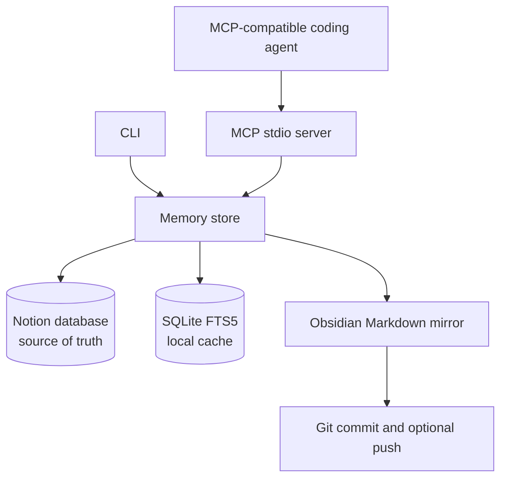
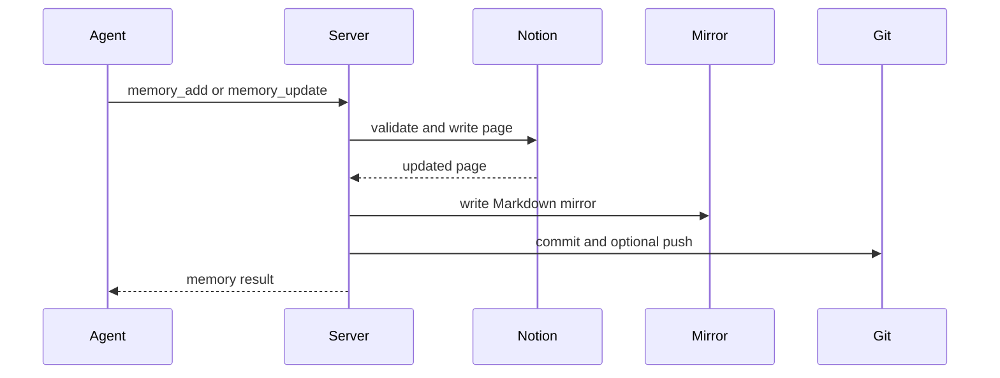
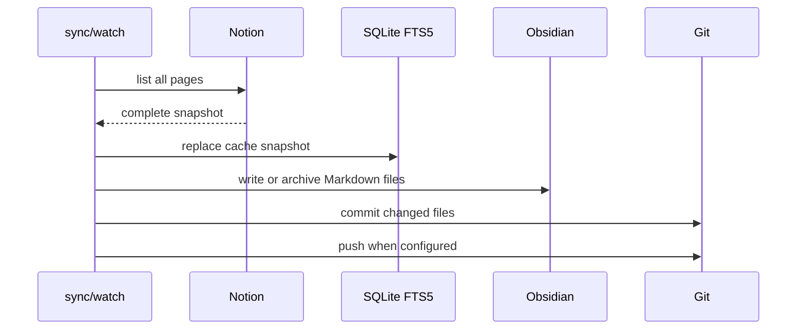

# Architecture

Shared Agent Memory MCP is a small Node.js service with two entry points:

- An MCP stdio server for coding agents.
- A CLI for setup, diagnostics, memory operations, synchronization, and cache management.

Notion stores the authoritative memory records. The local SQLite FTS5 database is a disposable search cache. Obsidian is an optional Markdown mirror for human review and Git history.

## System diagram



## Components

- `src/index.ts` validates MCP tool input with Zod and exposes the MCP server.
- `src/cli.ts` provides setup, doctor, CRUD, export, sync, watch, and cache commands.
- `src/store.ts` reads and writes Notion, maps pages to memory objects, handles duplicate detection, and coordinates Obsidian synchronization.
- `src/cache.ts` manages the disposable SQLite FTS5 index and cache freshness metadata.
- `src/memory-quality.ts` normalizes text and scores possible duplicates.
- `src/provenance.ts` normalizes provenance values and calculates freshness.
- `src/obsidian.ts` writes Markdown files, archives files, performs Git synchronization, and prevents duplicate watchers.
- `src/config.ts` loads local environment configuration without overwriting explicitly supplied process variables.

## Write flow



Notion is written before the local mirror. If the mirror or Git operation fails, the Notion write remains authoritative and the failure is reported by the relevant operation.

## Synchronization flow



A normal synchronization refreshes the cache from the same Notion snapshot used for the Markdown mirror. `sync --dry-run` reads the snapshot but does not write cache, Markdown, or Git.

## Hybrid search policy

`memory_search` uses the local cache only when all of the following are true:

- The query contains text.
- The requested status is active.
- No agent, category, or tag filter is present.
- The cache snapshot is no older than five minutes.
- Each cached row contains the serialized full memory payload.

Project filtering is supported by the cache. Any request outside this policy queries Notion directly. If the cache is missing, stale, corrupt, or incomplete, the search falls back to Notion. The cache never becomes the source of truth.

## Cache consistency

Successful `memory_add`, `memory_update`, and `memory_delete` operations clear the local cache. This prevents a known local snapshot from being returned after a mutation. The next normal `sync` or `cache rebuild` recreates the index.

The cache uses a metadata timestamp named `last_sync`. Cache files live under `.cache/` and are excluded from Git. Removing the cache is safe because it contains no authoritative data.

## Data model

Memory records contain required core fields:

- ID, title, content, agent, category, tags, importance, status, URL, creation time, and update time.

Optional quality fields include:

- Project scope.
- Provenance source and confidence.
- Verification time and freshness period.
- ID of a memory that the record supersedes.

The Notion page schema is detected when optional fields are written. Existing databases without optional properties remain usable.

## Failure behavior

- Missing Notion credentials: commands fail with an actionable configuration message.
- Notion access failure: the operation fails; no cache is refreshed from an incomplete snapshot.
- Missing or stale cache: search falls back to Notion.
- Failed Git push: local mirror changes and the local commit remain available for retry.
- Missing Obsidian vault: core Notion memory operations can continue without the mirror.
- Duplicate watcher: the lock prevents a second polling process.
- Invalid MCP input: Zod rejects it before storage.

## Security model

Credentials are read from process environment variables or a local `.env` file. They are never part of MCP tool arguments, serialized memory data, Markdown frontmatter, Git commits, or logs. The repository excludes `.env`, SQLite databases, logs, generated output, and local IDE files.

## Consistency boundaries

The system intentionally uses one-way synchronization:

```text
Notion -> Obsidian -> Git
```

Manual Obsidian edits are not imported into Notion. This avoids silent two-way conflicts and keeps ownership clear. Notion changes become visible in Obsidian after `sync` or the polling watcher runs.
