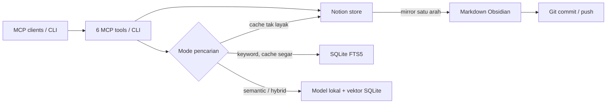

# Analisis mendalam Shared Agent Memory MCP v1.5.0

Analisis ini membandingkan kode pada commit `8a45dc0` dengan dokumentasi resmi proyek sejenis yang diperiksa pada 14 September 2026. Penilaian kompetitor didasarkan pada kemampuan yang mereka dokumentasikan, bukan benchmark independen atau uji instalasi terhadap seluruh produk. Penilaian proyek ini didasarkan pada jalur eksekusi aktif di `src/`, bukan nama modul atau klaim historis.

## Penilaian utama

Produk sudah memiliki posisi yang jelas: satu memori bersama untuk beberapa coding agent, Notion sebagai sumber data yang dapat diaudit manusia, pencarian lokal FTS5/semantik, dan mirror Markdown untuk Obsidian. Perlindungan konflik dan pelaporan kegagalan parsial setelah penulisan Notion adalah keunggulan praktis. Namun, mutu pencarian pada koleksi panjang, konsistensi sinkronisasi berkala, dan keluaran MCP yang hemat konteks belum cukup kuat untuk menyebutnya sebagai solusi memori terbaik secara umum.

Peluang produk yang paling masuk akal adalah **memori proyek lintas agent yang dapat dipercaya dan dapat ditelusuri**, bukan menyalin seluruh fitur graph database, dashboard, atau platform cloud sekaligus. Proyek ini dapat unggul lewat sumber fakta yang jelas, status verifikasi, hasil pencarian yang menjelaskan alasan relevansi, dan sinkronisasi yang aman.

## Arsitektur yang benar-benar aktif

| Kemampuan saat ini | Bukti kode | Batas praktis |
|---|---|---|
| Enam tool MCP: cari, terbaru, ambil, tambah, ubah, hapus | `src/index.ts:43-219` | Tool hanya mengembalikan JSON sebagai teks; belum ada `structuredContent`, `outputSchema`, anotasi perilaku, resource, atau prompt. `memory_search` tidak mengekspos filter `status` meski lapisan store mendukungnya. |
| Notion adalah sumber data; Obsidian adalah mirror satu arah | `src/store.ts:316-349`, `src/store.ts:485-506`; `src/obsidian.ts:268-292` | Edit Obsidian tidak otomatis menjadi fakta Notion. Konflik ditahan sebagai salinan, sehingga pemulihan tetap perlu keputusan manusia. |
| Keyword lokal, semantik, dan hybrid | `src/store.ts:366-423`; `src/semantic-search.ts:50-123` | Mode semantik membutuhkan cache segar. Setiap memori hanya diwakili judul dan 1.200 karakter awal, lalu seluruh vektor kandidat dihitung di proses aplikasi. Tidak ada pencarian berbasis potongan, ANN, cuplikan cocok, atau skor pada hasil MCP. |
| Cache dan embedding persisten | `src/cache.ts:40-124` | Cache dianggap segar selama 5 menit, sama dengan interval default `watch`, dan berlokasi di `process.cwd()/.cache`; beberapa client dengan direktori kerja berbeda dapat melihat cache berbeda. Setelah penulisan Notion, cache dibersihkan, bukan diperbarui per memori. |
| Metadata asal, keyakinan, verifikasi, dan pengganti | `src/provenance.ts:1-36`; `src/store.ts:287-313` | Metadata tampil dalam memori, tetapi `freshness` dan `supersedes` belum dipakai untuk menyingkirkan atau menurunkan peringkat fakta lama saat pencarian. |
| Pencegahan duplikat berbasis token | `src/store.ts:104-107`; `src/memory-quality.ts:1-41` | Kandidat hanya 100 memori aktif terakhir dan kemiripan berupa tumpang tindih kata. Parafrasa atau memori lama dapat terlewat. |
| Sinkronisasi periodik dan diagnostik | `src/cli.ts:466-485`; `src/doctor.ts:33-73` | `setInterval` dapat memulai sinkronisasi baru ketika sebelumnya belum selesai. Pemeriksaan proses watcher memakai `powershell.exe`, sehingga hasilnya tidak portabel ke Linux/macOS. |
| Metadata versi MCP | `package.json:3`; `src/index.ts:18-21` | Paket bernomor 1.5.0, tetapi server MCP masih mengiklankan 1.0.0. |

Modul `memory-pool.ts`, `incremental-index.ts`, `hybrid-search.ts`, `ranking.ts`, dan `vector-search.ts` masih terpisah dari jalur MCP aktif. Keberadaan file dan tes modul tersebut tidak membuktikan kemampuan produk yang dipakai pengguna. `sqlite-vec` sudah menjadi dependensi, tetapi jalur `semantic-search.ts` yang aktif belum memakainya untuk pencarian vektor terindeks.

## Proyek pembanding dan pelajaran yang dapat diambil

| Proyek | Kemampuan yang terverifikasi dari sumber resminya | Pelajaran untuk proyek ini | Perbedaan penting |
|---|---|---|---|
| [Basic Memory](https://github.com/basicmachines-co/basic-memory/blob/main/README.md) | Markdown lokal sebagai sumber utama, edit dua arah, relasi WikiLink, pencarian semantik/hybrid, reranking opsional, hasil per potongan, tool annotations, impor percakapan. [^1][^2] | Prioritaskan hasil pencarian yang mengembalikan potongan relevan, bukan seluruh memori. Tambahkan hubungan eksplisit antarmemori setelah semantik dasar terukur. | Arsitektur mereka berbasis file; proyek ini berbasis Notion. Sinkronisasi dua arah tidak dapat disalin tanpa mengubah kontrak sumber data. |
| [MCP Reference Memory Server](https://github.com/modelcontextprotocol/servers/blob/main/src/memory/README.md) | Entitas, observasi atomik, relasi, resource `memory://knowledge-graph`, serta tool untuk memanipulasi graph. [^3] | Satu atau dua jenis relasi seperti `supersedes` dan `relates_to` dapat memberi navigasi yang berguna tanpa membangun graph engine besar. | Server referensi sederhana dan tidak menawarkan alur Notion/Obsidian atau semantik lokal yang sama. |
| [Graphiti MCP](https://github.com/getzep/graphiti/blob/main/mcp_server/README.md) | Episode, entitas, fakta, pencarian hibrida, dan waktu berlakunya fakta. [^4] | Jadikan status fakta lama dan jejak sumber sebagai bagian dari hasil pencarian; `supersedes` yang sudah ada adalah titik awal. | Graphiti membutuhkan infrastruktur graph dan operasi ekstraksi yang jauh lebih berat. |
| [Mem0](https://docs.mem0.ai/open-source/overview) / [Mem0 MCP](https://github.com/mem0ai/mem0/blob/main/docs/platform/mem0-mcp.mdx) | Platform MCP ter-host, memori dari interaksi, scope pengguna/agent/sesi; OSS menawarkan retrieval, filter, reranking, dan komponen yang dapat dikonfigurasi. [^5][^6] | Tambahkan penangkapan fakta dari sesi secara **opt-in dengan pratinjau** serta scope yang jelas, bukan menyimpan seluruh transkrip otomatis. | Produk MCP ter-host dan OSS berbeda. Dokumentasi migrasi OSS menyebut graph store lama dihapus; jangan menganggap semua kemampuan historis berlaku pada versi sekarang. [^7] |
| [MCP Memory Service](https://github.com/doobidoo/mcp-memory-service/blob/main/docs/README.md) | Penyimpanan lokal/cloud, semantik, multi-client, Docker, serta HTTP/SSE menurut dokumentasinya. [^8] | Tambahkan pilihan transport jarak jauh hanya bila benar-benar ada kebutuhan tim; desain autentikasi dan isolasi data harus mendahuluinya. | Cakupan platformnya luas dan konsekuensi operasi jauh lebih besar daripada server stdio lokal. |
| [Letta](https://github.com/letta-ai/letta-docs-md/blob/main/configuration/memory/index.md) | Memori agent dalam filesystem berbasis Git, perintah untuk mengingat, pemeriksaan kesehatan, dan konsolidasi latar belakang. [^9] | Pertimbangkan ringkasan sesi serta revisi memori yang dapat ditinjau manusia, terutama untuk keputusan proyek yang berubah. | Letta adalah platform agent penuh, bukan pengganti langsung server memori MCP ini. |

Tabel tersebut adalah pembanding desain, bukan skor kualitas produk. Tidak ada benchmark head-to-head atau audit reliabilitas independen yang cukup untuk menyatakan satu produk “terbaik”.

## Prioritas pengembangan

### P0 — stabilkan kontrak sebelum memperluas fitur

1. **Serialkan `watch` dan jelaskan statusnya.** Pastikan hanya satu sinkronisasi berjalan, proses berikutnya dijadwalkan setelah yang sebelumnya selesai, dan kegagalan/konflik tidak tertutup oleh run baru. Kriteria selesai: tes dengan sinkronisasi yang diperlambat membuktikan jumlah run aktif maksimum satu; Git dan manifest tetap konsisten.
2. **Perbaiki `doctor --sync` lintas platform.** Gunakan cara pemeriksaan PID yang sesuai sistem operasi dan bedakan watcher yang sengaja tidak dijalankan dari lock rusak. Kriteria selesai: fixture Windows/Linux/macOS serta pemeriksaan manual minimal pada Windows dan CI Linux menghasilkan status yang benar.
3. **Satukan identitas instalasi.** Ambil versi MCP dari metadata paket, jadikan lokasi cache stabil/terkonfigurasi, dan tampilkan lokasi efektif dalam `doctor`. Kriteria selesai: `initialize.serverInfo.version` sama dengan `package.json`; dua client dengan direktori kerja berbeda dapat memakai cache yang sama bila dikonfigurasi.
4. **Perkuat konsistensi penulisan.** Tambahkan idempotency key atau token operasi untuk `memory_add`, serta tes pada hasil Notion yang berhasil tetapi respons jaringan terputus. Kriteria selesai: pengulangan operasi yang sama tidak menghasilkan dua halaman. Ini melengkapi pelaporan kegagalan mirror/cache yang sudah baik.
5. **Buat evaluasi retrieval yang dapat direproduksi.** Siapkan koleksi 100/1.000/10.000 memori dan kueri Indonesia–Inggris dengan jawaban relevan yang ditandai manual. Ukur Recall@5, MRR@10, p50/p95 latensi, waktu indeks, serta ukuran model/cache. Angka performa historis tidak boleh dipakai sebagai target tanpa prosedur ini.

### P1 — fitur dengan manfaat pengguna tertinggi

1. **Pencarian berbasis potongan.** Pecah konten panjang menjadi potongan beridentitas, simpan hash dan vektor per potongan, lalu tampilkan cuplikan yang cocok beserta ID dan alasan kecocokan. Pertahankan `memory_get` untuk konten penuh. Karena `memory_search` sekarang mengirim isi lengkap, tambah opsi respons ringkas terlebih dahulu agar client lama tetap kompatibel.
2. **Indeks vektor terukur.** Bandingkan pemindaian `Float32Array` saat ini dengan `sqlite-vec` yang sudah terpasang. Pilih indeks hanya jika p95 dan relevansi lebih baik pada dataset target; jangan menambah backend sebelum ada angka.
3. **Deduplikasi lintas seluruh koleksi.** Cari kandidat melalui FTS/semantik dalam scope proyek, lalu nilai kemiripan; jangan membatasi pada 100 halaman terbaru. Tampilkan alasan dan kandidat ketika menolak duplikat, serta izinkan pembaruan memori lama.
4. **Keluaran MCP yang lebih berguna bagi agent.** Tambahkan `structuredContent`/`outputSchema`, anotasi tool baca/tulis/hapus, filter status, dan paginasi. SDK yang sudah dipasang mempunyai tipe untuk anotasi dan output schema; spesifikasi MCP mendukung kedua fitur itu. [^10] Pertahankan JSON teks selama masa kompatibilitas.
5. **Siklus hidup fakta.** Gunakan `verifiedAt`, `freshnessDays`, `confidence`, dan `supersedes` yang sudah ada untuk menandai hasil usang serta memberi opsi menyembunyikan fakta yang diganti. Jangan langsung menghapus sejarah; tampilkan hubungan pengganti.

### P2 — perlu validasi kebutuhan terlebih dahulu

- **Impor sesi dan tangkapan fakta dengan pratinjau.** Mulai dari `import --dry-run` untuk Markdown/JSON dan proposal memori yang memerlukan persetujuan. Risiko utama ialah duplikat, kebocoran rahasia, memori berumur pendek, serta batas laju/ukuran API Notion. [^12]
- **Relasi eksplisit yang kecil.** `relates_to`, `depends_on`, `supersedes` dapat memberi traversal 1–2 hop. Simpan asal setiap relasi dan izinkan koreksi; jangan langsung mengekstraksi seluruh graph otomatis.
- **Transport Streamable HTTP untuk tim.** Kerjakan hanya bila ada kebutuhan akses jarak jauh; protokol mensyaratkan perlindungan origin dan autentikasi yang memadai. [^11] Stdio tetap jalur sederhana untuk pemakaian pribadi.
- **Review perubahan Obsidian ke Notion.** Mulai dari usulan diff dan tombol/CLI terima, bukan sinkronisasi otomatis dua arah. Kontrak sumber kebenaran harus disepakati sebelum implementasi.

## Urutan implementasi yang disarankan

| Tahap | Hasil yang dapat ditinjau | Ukuran keberhasilan |
|---|---|---|
| 1 — Reliabilitas | Watch serial, doctor lintas platform, versi MCP benar, lokasi cache jelas | Tidak ada run sinkronisasi tumpang tindih; Windows dan Linux lulus; `doctor` menjelaskan cache efektif |
| 2 — Evaluasi pencarian | Dataset dan harness benchmark, laporan baseline keyword/semantic/hybrid | Recall@5/MRR@10 dan p95 terukur serta dapat diulang di CI atau mesin referensi |
| 3 — Pencarian kaya konteks | Potongan, cuplikan, opsi hasil ringkas, skor/metadata terstruktur | Jawaban relevan muncul di luar 1.200 karakter awal; ukuran respons MCP terkontrol |
| 4 — Memori yang tetap benar | Deduplikasi seluruh koleksi, verifikasi ulang, `supersedes` aktif | Memori lama yang diganti tidak lagi menyesatkan pencarian; keputusan revisi terlacak |
| 5 — Perluasan terpilih | Impor dengan pratinjau dan relasi sederhana | Pengguna dapat meninjau semua penulisan otomatis sebelum disimpan |

## Hal yang sebaiknya tidak dilakukan dulu

- Mengaktifkan modul tiered-memory dan hash-vector lama hanya karena file/tesnya ada. Keduanya bukan jalur produk aktif dan tidak menggantikan evaluasi semantik.
- Menjanjikan kemampuan offline penuh selama penulisan tetap wajib melalui Notion. Antrian offline adalah perubahan kontrak konsistensi yang besar.
- Mengubah mirror Obsidian menjadi sumber tulis kedua tanpa aturan konflik dan otoritas yang eksplisit.
- Menambahkan dashboard, graph database, dan server HTTP sekaligus. Masing-masing memperluas permukaan keamanan serta operasi, sementara masalah retrieval dan sinkronisasi dasar masih dapat diselesaikan dengan stack sekarang.

## Batas penilaian

Audit ini tidak menjalankan benchmark terhadap dataset besar atau memasang semua proyek pembanding. Kemampuan kompetitor di atas adalah klaim yang ditemukan pada dokumentasi/repositori resmi dan dapat berubah. Temuan lokal adalah pembacaan kode rilis v1.5.0; risiko tumpang tindih `watch` adalah inferensi dari `setInterval` dan belum direproduksi sebagai insiden produksi. Tidak ada perubahan kode atau data Notion yang dibuat selama analisis ini.

## Sumber

[^1]: Basic Machines, [Basic Memory README](https://github.com/basicmachines-co/basic-memory/blob/main/README.md), diperiksa 14 September 2026.
[^2]: Basic Machines, [Semantic Search](https://github.com/basicmachines-co/basic-memory/blob/main/docs/semantic-search.md), diperiksa 14 September 2026.
[^3]: Model Context Protocol, [Knowledge Graph Memory Server](https://github.com/modelcontextprotocol/servers/blob/main/src/memory/README.md), diperiksa 14 September 2026.
[^4]: Zep, [Graphiti MCP Server README](https://github.com/getzep/graphiti/blob/main/mcp_server/README.md), diperiksa 14 September 2026.
[^5]: Mem0, [Open Source Overview](https://docs.mem0.ai/open-source/overview), diperiksa 14 September 2026.
[^6]: Mem0, [Mem0 MCP](https://github.com/mem0ai/mem0/blob/main/docs/platform/mem0-mcp.mdx) dan [Add Memory](https://docs.mem0.ai/core-concepts/memory-operations/add), diperiksa 14 September 2026.
[^7]: Mem0, [Migrating to the New Memory Algorithm](https://docs.mem0.ai/platform/features/graph-memory), diperiksa 14 September 2026.
[^8]: MCP Memory Service, [Documentation Overview](https://github.com/doobidoo/mcp-memory-service/blob/main/docs/README.md), diperiksa 14 September 2026.
[^9]: Letta, [Memory & Dreaming](https://github.com/letta-ai/letta-docs-md/blob/main/configuration/memory/index.md), diperiksa 14 September 2026.
[^10]: Model Context Protocol, [Tools specification](https://modelcontextprotocol.io/specification/2025-06-18/server/tools), diperiksa 14 September 2026.
[^11]: Model Context Protocol, [Transports specification](https://modelcontextprotocol.io/specification/2025-03-26/basic/transports), diperiksa 14 September 2026.
[^12]: Notion, [Request limits](https://developers.notion.com/reference/request-limits), diperiksa 14 September 2026. Notion mendokumentasikan pembatasan laju dan ukuran; karena itu antrian dan pengujian limit diperlukan sebelum sinkronisasi atau impor massal.
